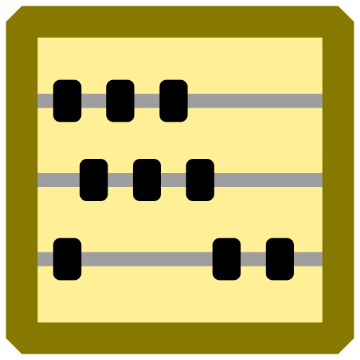

<!--
SPDX-FileCopyrightText: 2024-2026 Friedrich von Never <friedrich@fornever.me>

SPDX-License-Identifier: MIT
-->

Tabularius  [![Status Zero][status-zero]][andivionian-status-classifier]
========
Tabularius is an ongoing implementation of UI for [hledger][].

Prerequisites
-------------
Tabularius is distributed as a self-contained application, so it does not require .NET to be installed.

See the [.NET 10 supported OS versions][dotnet.supported-os] for the list of system requirements.

Installation
------------
Download the archive for your platform from the [Releases][releases] page and unpack it to a directory of your choice. The following platforms are available:
- Windows (x64)
- Linux (x64, ARM64)
- macOS (ARM64)

Command Line
------------
```
tabularius [--config <config-path>]
```

where
- `config-path` is the path to a JSON configuration file. If omitted, default settings are used. If provided, the file must exist.

### Exit Codes

| Code | Description                                                |
|------|------------------------------------------------------------|
| 0    | Success.                                                   |
| 1    | Configuration file specified via `--config` was not found. |
| 2    | Configuration file is invalid (parse error).               |
| 3    | `--config` was specified without a file path.              |

Configuration
-------------
Tabularius uses a JSON configuration file. When no configuration file is provided, the application uses default settings: logs are written to the console and to a file in the system temporary directory.

The configuration file uses the standard [Serilog.Settings.Configuration][serilog.settings.configuration] format:

```json
{
  "Serilog": {
    "Using": ["Serilog.Sinks.Console", "Serilog.Sinks.File"],
    "MinimumLevel": "Information",
    "WriteTo": [
      { "Name": "Console" },
      {
        "Name": "File",
        "Args": { "path": "/tmp/tabularius/tabularius.log" }
      }
    ]
  }
}
```

See the [Serilog.Settings.Configuration documentation][serilog.settings.configuration] for the full list of available Serilog options.

### Application Settings

| Key              | Type   | Default | Description                                                                         |
|------------------|--------|---------|-------------------------------------------------------------------------------------|
| `DiagnosticMode` | `bool` | `false` | When `true`, shows various test controls in the status bar for diagnostic purposes. |

Example configuration with application settings:

```json
{
  "DiagnosticMode": true,
  "Serilog": {
    "Using": ["Serilog.Sinks.Console", "Serilog.Sinks.File"],
    "MinimumLevel": "Information",
    "WriteTo": [
      { "Name": "Console" },
      {
        "Name": "File",
        "Args": { "path": "/tmp/tabularius/tabularius.log" }
      }
    ]
  }
}
```

Files
-----
Tabularius stores its log files in the following location (when using default configuration):
- **Windows**: `%TEMP%\tabularius\tabularius.log`
- **Linux/macOS**: `$TMPDIR/tabularius/tabularius.log` (typically `/tmp/tabularius/tabularius.log`)

Documentation
-------------
- [Changelog][docs.changelog]
- [Contributor Guide][docs.contributing]
- [Maintainer Guide][docs.maintaining]

License
-------
The project is distributed under the terms of [the MIT license][docs.license].

The license indication in the project's sources is compliant with the [REUSE specification v3.3][reuse.spec].

[andivionian-status-classifier]: https://andivionian.fornever.me/v1/#status-zero-
[docs.changelog]: CHANGELOG.md
[docs.contributing]: CONTRIBUTING.md
[docs.license]: LICENSE.txt
[docs.maintaining]: MAINTAINING.md
[dotnet.supported-os]: https://github.com/dotnet/core/blob/main/release-notes/10.0/supported-os.md
[hledger]: https://hledger.org/
[releases]: https://github.com/ForNeVeR/tabularius/releases
[reuse.spec]: https://reuse.software/spec-3.3/
[reuse]: https://reuse.software/
[serilog.settings.configuration]: https://github.com/serilog/serilog-settings-configuration
[status-zero]: https://img.shields.io/badge/status-zero-lightgrey.svg
